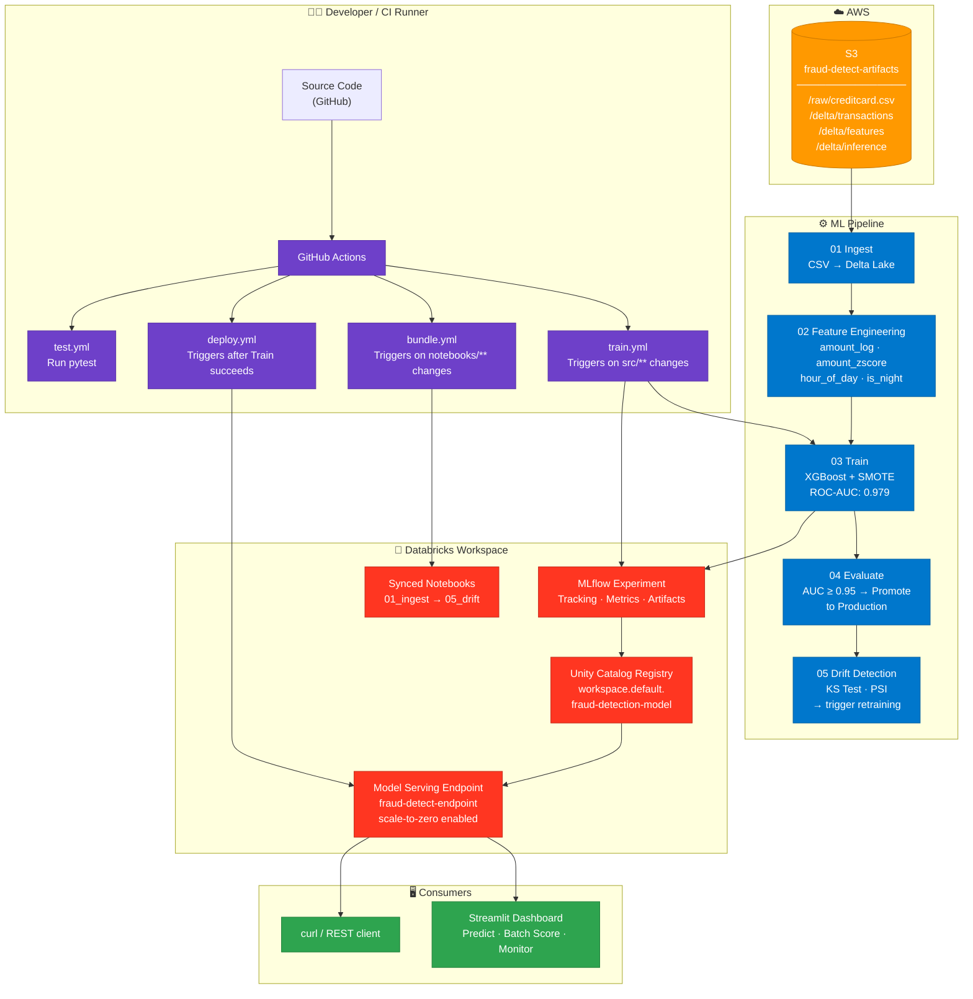
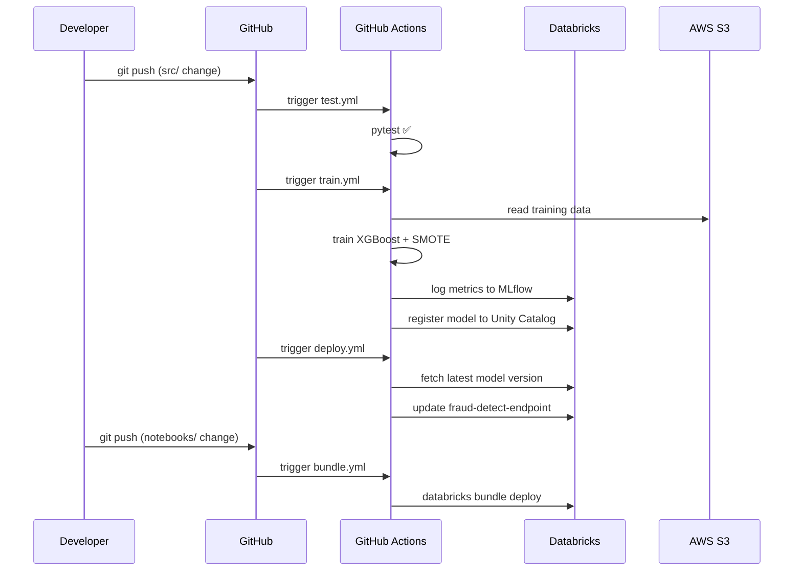

# Architecture Diagram

## System Architecture

```mermaid
flowchart TD
    subgraph DEV["👩‍💻 Developer / CI Runner"]
        code["Source Code\n(GitHub)"]
        gha["GitHub Actions"]
        code --> gha
        gha --> test_wf["test.yml\nRun pytest"]
        gha --> train_wf["train.yml\nTriggers on src/** changes"]
        gha --> bundle_wf["bundle.yml\nTriggers on notebooks/** changes"]
        gha --> deploy_wf["deploy.yml\nTriggers after Train succeeds"]
    end

    subgraph AWS["☁️ AWS"]
        s3[("S3\nfraud-detect-artifacts\n───────────────\n/raw/creditcard.csv\n/delta/transactions\n/delta/features\n/delta/inference")]
    end

    subgraph PIPELINE["⚙️ ML Pipeline"]
        ingest["01 Ingest\nCSV → Delta Lake"]
        features["02 Feature Engineering\namount_log · amount_zscore\nhour_of_day · is_night"]
        train["03 Train\nXGBoost + SMOTE\nROC-AUC: 0.979"]
        evaluate["04 Evaluate\nAUC ≥ 0.95 → Promote\nto Production"]
        drift["05 Drift Detection\nKS Test · PSI\n→ trigger retraining"]

        ingest --> features --> train --> evaluate --> drift
    end

    subgraph DATABRICKS["🧱 Databricks Workspace"]
        mlflow["MLflow Experiment\nTracking · Metrics · Artifacts"]
        registry["Unity Catalog Registry\nworkspace.default.\nfraud-detection-model"]
        serving["Model Serving Endpoint\nfraud-detect-endpoint\nscale-to-zero enabled"]
        notebooks["Synced Notebooks\n01_ingest → 05_drift"]
    end

    subgraph CONSUMERS["🖥️ Consumers"]
        curl["curl / REST client"]
        streamlit["Streamlit Dashboard\nPredict · Batch Score · Monitor"]
    end

    %% Data flow
    s3 --> ingest
    train --> mlflow
    mlflow --> registry
    registry --> serving

    %% CI/CD triggers
    train_wf --> train
    train_wf --> mlflow
    deploy_wf --> serving
    bundle_wf --> notebooks

    %% Consumer access
    serving --> curl
    serving --> streamlit

    %% Styles
    classDef aws       fill:#FF9900,color:#fff,stroke:#c97700
    classDef databricks fill:#FF3621,color:#fff,stroke:#c72a19
    classDef pipeline  fill:#0077CC,color:#fff,stroke:#005fa3
    classDef consumer  fill:#2ea44f,color:#fff,stroke:#22813d
    classDef cicd      fill:#6e40c9,color:#fff,stroke:#5a33a8

    class s3 aws
    class mlflow,registry,serving,notebooks databricks
    class ingest,features,train,evaluate,drift pipeline
    class curl,streamlit consumer
    class gha,test_wf,train_wf,bundle_wf,deploy_wf cicd
```

---

## CI/CD Flow

```mermaid
sequenceDiagram
    participant Dev as Developer
    participant GH  as GitHub
    participant CI  as GitHub Actions
    participant DB  as Databricks
    participant S3  as AWS S3

    Dev->>GH: git push (src/ change)
    GH->>CI: trigger test.yml
    CI->>CI: pytest ✅

    GH->>CI: trigger train.yml
    CI->>S3: read training data
    CI->>CI: train XGBoost + SMOTE
    CI->>DB: log metrics to MLflow
    CI->>DB: register model to Unity Catalog

    GH->>CI: trigger deploy.yml
    CI->>DB: fetch latest model version
    CI->>DB: update fraud-detect-endpoint

    Dev->>GH: git push (notebooks/ change)
    GH->>CI: trigger bundle.yml
    CI->>DB: databricks bundle deploy
```

---

## Data Flow

```mermaid
flowchart LR
    raw["creditcard.csv\n284,807 rows\n0.17% fraud"] --> fe

    subgraph fe["Feature Engineering"]
        direction TB
        a1["amount_log = log1p(Amount)"]
        a2["amount_zscore = z-score(Amount)"]
        a3["hour_of_day = Time mod 86400 ÷ 3600"]
        a4["is_night = 1 if hour < 6 or ≥ 22"]
    end

    fe --> split["Train / Test Split\n80% / 20% stratified"]
    split --> smote["SMOTE\nOversample minority class\n454,902 balanced rows"]
    smote --> model["XGBoost\nn_estimators=200\nmax_depth=6\nlr=0.05"]
    model --> metrics["Metrics\nROC-AUC: 0.979\nPrecision: 0.42\nRecall: 0.87"]
    metrics --> gate{"AUC ≥ 0.95?"}
    gate -->|Yes| prod["Promote to Production"]
    gate -->|No| skip["Skip — keep current version"]
```
