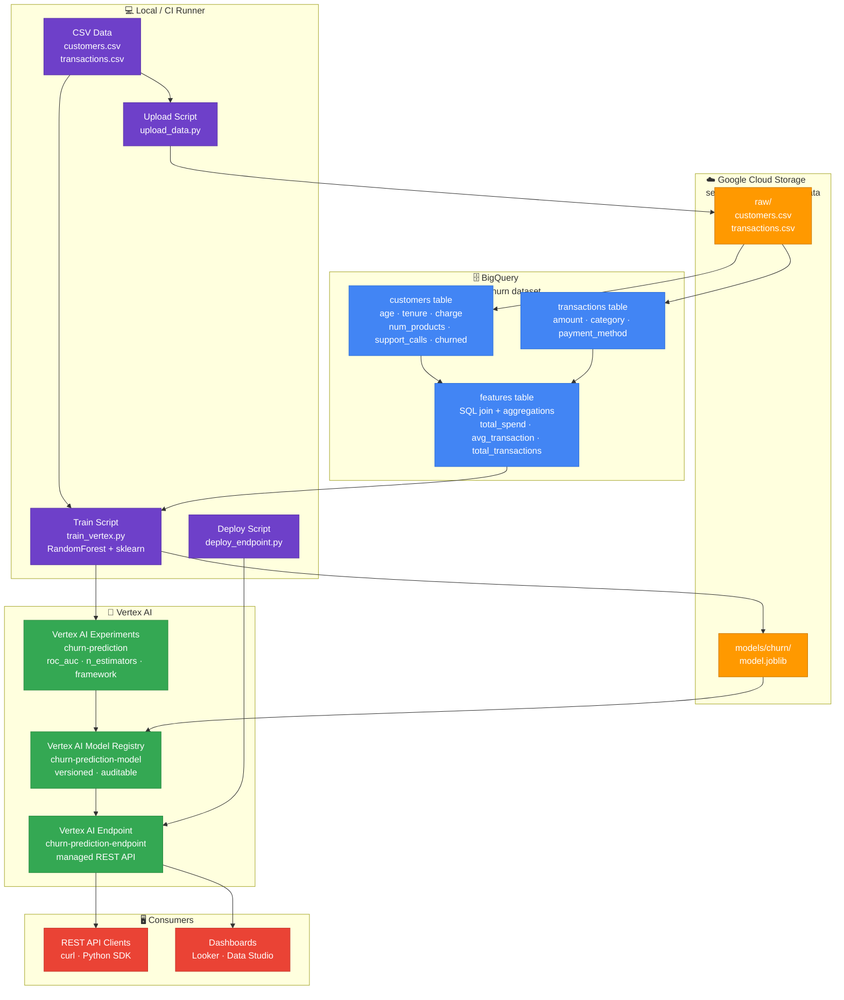
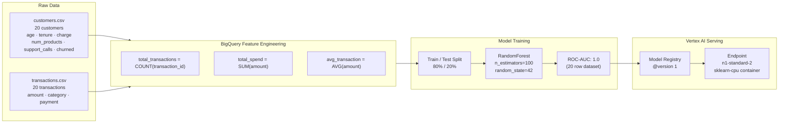
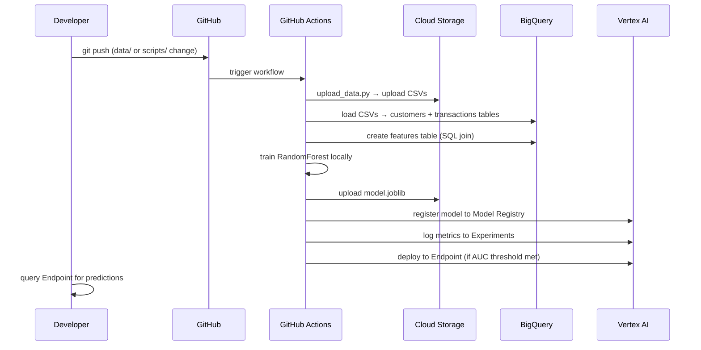

# Architecture Diagrams

## System Architecture

```mermaid
flowchart TD
    subgraph LOCAL["💻 Local / CI Runner"]
        csv["CSV Data\ncustomers.csv\ntransactions.csv"]
        train["Train Script\ntrain_vertex.py\nRandomForest + sklearn"]
        upload["Upload Script\nupload_data.py"]
        deploy["Deploy Script\ndeploy_endpoint.py"]
        csv --> upload
        csv --> train
    end

    subgraph GCS["☁️ Google Cloud Storage\nserious-bliss-256222-ml-data"]
        raw["raw/\ncustomers.csv\ntransactions.csv"]
        models["models/churn/\nmodel.joblib"]
    end

    subgraph BQ["🗄️ BigQuery\nml_churn dataset"]
        t_customers["customers table\nage · tenure · charge\nnum_products · support_calls · churned"]
        t_transactions["transactions table\namount · category · payment_method"]
        t_features["features table\nSQL join + aggregations\ntotal_spend · avg_transaction · total_transactions"]
        t_customers --> t_features
        t_transactions --> t_features
    end

    subgraph VERTEX["🧠 Vertex AI"]
        experiments["Vertex AI Experiments\nchurn-prediction\nroc_auc · n_estimators · framework"]
        registry["Vertex AI Model Registry\nchurn-prediction-model\nversioned · auditable"]
        endpoint["Vertex AI Endpoint\nchurn-prediction-endpoint\nmanaged REST API"]
        experiments --> registry
        registry --> endpoint
    end

    subgraph CONSUMERS["🖥️ Consumers"]
        api["REST API Clients\ncurl · Python SDK"]
        dashboard["Dashboards\nLooker · Data Studio"]
    end

    upload --> raw
    raw --> t_customers
    raw --> t_transactions
    t_features --> train
    train --> models
    train --> experiments
    models --> registry
    deploy --> endpoint
    endpoint --> api
    endpoint --> dashboard

    classDef gcs      fill:#FF9900,color:#fff,stroke:#c97700
    classDef bq       fill:#4285F4,color:#fff,stroke:#2a6dd9
    classDef vertex   fill:#34A853,color:#fff,stroke:#278a3f
    classDef local    fill:#6e40c9,color:#fff,stroke:#5a33a8
    classDef consumer fill:#EA4335,color:#fff,stroke:#c5392d

    class raw,models gcs
    class t_customers,t_transactions,t_features bq
    class experiments,registry,endpoint vertex
    class csv,train,upload,deploy local
    class api,dashboard consumer
```

---

## Data Flow

```mermaid
flowchart LR
    subgraph raw["Raw Data"]
        c["customers.csv\n20 customers\nage · tenure · charge\nnum_products · support_calls · churned"]
        t["transactions.csv\n20 transactions\namount · category · payment"]
    end

    subgraph fe["BigQuery Feature Engineering"]
        direction TB
        f1["total_transactions = COUNT(transaction_id)"]
        f2["total_spend = SUM(amount)"]
        f3["avg_transaction = AVG(amount)"]
    end

    subgraph model["Model Training"]
        split["Train / Test Split\n80% / 20%"]
        rf["RandomForest\nn_estimators=100\nrandom_state=42"]
        metrics["ROC-AUC: 1.0\n(20 row dataset)"]
    end

    subgraph serving["Vertex AI Serving"]
        reg["Model Registry\n@version 1"]
        ep["Endpoint\nn1-standard-2\nsklearn-cpu container"]
    end

    c --> fe
    t --> fe
    fe --> split
    split --> rf
    rf --> metrics
    metrics --> reg
    reg --> ep
```

---

## CI/CD Flow (Future State)

```mermaid
sequenceDiagram
    participant Dev  as Developer
    participant GH   as GitHub
    participant CI   as GitHub Actions
    participant GCS  as Cloud Storage
    participant BQ   as BigQuery
    participant VA   as Vertex AI

    Dev->>GH: git push (data/ or scripts/ change)
    GH->>CI: trigger workflow

    CI->>GCS: upload_data.py → upload CSVs
    CI->>BQ: load CSVs → customers + transactions tables
    CI->>BQ: create features table (SQL join)
    CI->>CI: train RandomForest locally
    CI->>GCS: upload model.joblib
    CI->>VA: register model to Model Registry
    CI->>VA: log metrics to Experiments
    CI->>VA: deploy to Endpoint (if AUC threshold met)

    Dev->>Dev: query Endpoint for predictions
```
